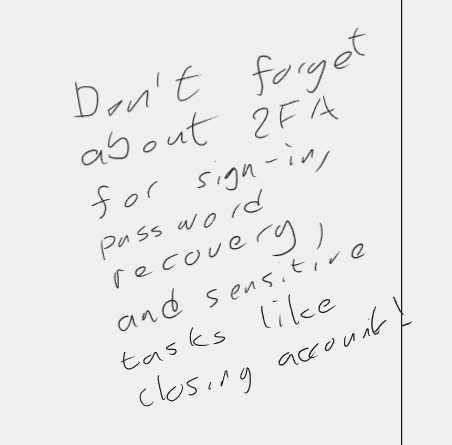

# Prompt Engineering

## Overview

This project is a production-ready implementation of two prompts that are used to configure ChatGPT to serve as a
principal developer for pull request review support 
([Tom](https://github.com/SebGSX/Prompt-Engineering/blob/main/prompt-engineering/pull-request-review.md)) and a product
manager ([Tim](https://github.com/SebGSX/Prompt-Engineering/blob/main/prompt-engineering/work-item-review.md)). The
prompts have been exhaustively developed and tested over a period of about a year.

### Objective

The primary objective of the project is to accelerate the delivery of high-quality work product. In other words, 
faster and higher quality first drafts of work, faster and higher quality reviews, and faster and higher quality
feedback, so that work flows more smoothly through the system.

### General Notes on Use

While creating Tim was relatively straightforward, creating Tom was a highly complex proposition that required a
suitably complex codebase upon which to "train" Tom. By train, I mean activate the prompt, provide Tom with code,
then carefully review the output. The author thus created a multi-threaded listener using lock primitives to help
ensure that Tom had a sufficiently complex problem to solve. As the code evolved, so too did the prompt.

> For reference, the author has included the codebase (with tests) used to train Tom in the `src` and `test` directories
> of this repository, respectively.

The result is a prompt that renders the latest model of ChatGPT as a highly capable principal developer adept at
analysing codded solutions irrespective of the language, frameworks, or packages used.

> **Important:** No AI is perfect. The AI cannot and does not replace the judgement of a human. Used as a very
> intelligent and knowledgeable assistant, the AI can be a powerful accelerator of work. That said, the user is
> ultimately accountable and responsible for the use of the AI and its outputs.

### AI Custom Instructions (Standing Instructions)

ChatGPT has a useful feature called Custom Instructions. This feature allows the user to provide the AI with a set
of standing instructions that are used to guide the AI in its all of its responses. Given that large language models
(LLMs) are probabilistic systems trained on vast amounts of data, it behoves the user to limit the AI's domain so
that more accurate and in-depth responses are generated.

The author has experimented with a variety of custom instructions over the past year to 18 months and has found that the
set provided within the [AI Custom Instructions](https://github.com/SebGSX/AI-Custom-Instructions) repository is the most effective.

> **Note:** The custom instructions do evolve and are thus subject to change. Given the experimental nature of the work
> the custom instructions are sometimes suboptimal and may contain errors or out-of-the-box thinking.

## Getting Started

To use the prompts, you will need to have access to OpenAI's ChatGPT service or the API. Other AIs will likely work;
however, the author has only tested OpenAI's variant.

In its simplest form, simply copy the prompt's text into the chat window, then provide the code that should be
reviewed. The same works for Tim, the product manager. A somewhat more sophisticated approach is to use the Custom
GPT feature of ChatGPT to create a customised chat using the prompts as the main system instructions. In that form,
style guides, policies, and other documentation can be included to help guide the AI in its reviews. Such an
approach is known as retrieval-augmented generation (RAG) and is a powerful tool for creating highly specialised AIs
without needing to train a model from scratch or fine-tune an existing one.

> **Important:** You MUST ensure that your organisation's policies and procedures are followed when using the 
> prompts and any AI service in general. There are legitimate risks associated with using AI in a professional context,
> including but not limited to: copyright infringement, data leakage, intellectual property theft, and more. Make
> sure that any AI service you use is approved, compliant with your organisation's policies, and that you have the
> necessary authorisations to use it. The author cannot and will not be held responsible for any misuse of the
> prompts or any AI service.

> **Note:** The author uses ChatGPT Team for all AI-related work. ChatGPT Team is a paid service that meets the 
> author's copyright, data, and intellectual property protection requirements. As at the time of writing, the author 
> has no affiliation with OpenAI or any other AI service provider.

### Getting Started with Tom (Principal Developer)

For a quick five-minute introduction to Tom, the AI principal developer, see the video below.

The author has found that the AI is more likely to provide a useful response if the code is:
- Well-formatted;
- Free of syntax errors;
- Complete, as in share the entire file or files that are to be reviewed;
- Clearly documented and annotated using domain-appropriate and precise, professional language in formal register;
- Compliant with applicable coding standards and conventions; and
- Mindful of naming such as the naming of namespaces, classes, methods, fields, properties, constants, and variables 
  are meaningful and descriptive.

> **Note:** The guidance above can be generalised to any technical prompt for best results.

#### Tom's Use Cases

Using the chat window, Tom can be used as a pre-commit reviewer, a post-commit reviewer, or as a reviewer of a proposed
change. Using the API, Tom can be integrated directly in the CI/CD pipeline to provide real-time feedback on proposed
changes. Using output generated by Tim (see below), Tom can also be used to generate code, particularly back-end code
and tests. If using test-driven development (TDD), Tom can create tests from acceptance criteria (must be Gherkin for
best results).

#### Sample Code to Test Tom

The code mentioned above and in the video is found within this repository in the `src` and `test` directories. To access
the code, please clone the repository and open the `Prompt Engineering.sln` file in Rider, VS Code, or Visual Studio.

For convenience, the link to the exact file demonstrated in the video is provided here:
[ListenerThread.cs](https://github.com/SebGSX/Prompt-Engineering/blob/main/src/OptimizedInternals/Threading/ListenerThread.cs).

### Getting Started with Tim (Product Manager)

For a quick eight-minute introduction to Tim, the AI product manager, see the video below.

The author has found that the AI is more likely to provide a useful response if the request for work item definition or
review is:
- Well-formatted;
- Specific and detailed--be sure to mention frameworks like SAFe or practices like TDD or BDD;
- Includes all necessary information;
- Uses domain-appropriate and precise, professional language in formal register; and
- Well-structured, organised, clear, and concise with a logical flow.

> **Note:** The guidance above can be generalised to any non-technical prompt for best results.

#### Tim's Use Cases

Using the chat window, Tim can be used to define work items--including business cases, non-functional requirements,
acceptance criteria (such as Gherkin), and more. An advanced approach is to use software such as [n8n](https://n8n.io/)
to automate the creation of work items using Tim, then have n8n create the work items in the underlying system.

Tim can be used to prepare work items for input from the product management team, then refinement in ceremonies such as
the three amigos, backlog grooming, sprint planning, and more. Ideally, product managers should discuss product ideas
with stakeholders, distill such conversations into a set of "I can <some-action> so that <some-benefit>" statements,
then use Tim to create the work items. Tim can also be used to review work items for completeness, correctness, and
compliance with applicable standards.

A final use-case for Tim is to back-fill work items for legacy systems or to create work items for systems that have
been developed without the benefit of a product manager. Doing so can help to ensure that the system is well-documented
and well-understood, guarding against issue regression and loss of knowledge. Back-filling work items is also a key
concern when implementing behaviour-driven development (BDD) or test-driven development (TDD) practices because the
team needs to have a clear understanding of the system's required behaviour and functionality.

#### Sample Work Item Content to Test Tim

The following table comprises an epic, five features, and 9 enabler and user stories in short form so that Tim has 
material to use as a starting point for generating work items.

| Work Item Type  | Work Item Text                                                                                                                   |
|-----------------|----------------------------------------------------------------------------------------------------------------------------------|
| Epic            | Identity and Access Management for App                                                                                           |
| Feature         | Sign-Up/Close Account                                                                                                            |
| Feature         | Sign-In/Sign-Out                                                                                                                 |
| Feature         | Forgot Username/Password                                                                                                         |
| Feature         | Change Security Info (Password, email, phone, etc.)                                                                              |
| Feature         | Manage Account (Profile, preferences, etc.)                                                                                      |
| User Story      | **I can** sign up with my name, email address, and password **so that** I can access the app.                                    |
| User Story      | **I can** close my account **so that** my personal information is removed from the system.                                       |
| User Story      | **I can** get feedback on sign-up errors **so that** I can correct those errors and sign up successfully.                        |
| User Story      | **I can** receive an activation email **so that** I can confirm that my sign-up is legitimate and thus use the app unrestricted. |
| User Story      | **I can** sign-in with my username and password **so that** I can access my account.                                             |
| Enabler Story   | An e-mailer is needed to send emails.                                                                                            |
| Enabler Story   | Encryption is needed for data in use, in transit, and at rest.                                                                   |
| Enabler Story   | Forms must be added for sign-up functionality to be surfaced to users.                                                           |
| Enabler Story   | Forms must be added for close account functionality to be surfaced to users.                                                     |

> Note that the text above is in simple "I can <some-action> so that <some-benefit>" format.

Using ChatGPT's GPT-4o model, Tim can also deal with handwritten notes like the sample below.

For convenience, the link to the exact file demonstrated in the video is provided here:
[ListenerThread.cs](https://github.com/SebGSX/Prompt-Engineering/blob/main/src/OptimizedInternals/Threading/ListenerThread.cs).

Given that Tim, the AI product manager, is designed to deal with a broad range of techniques, practices, frameworks, 
etc., requests to Tim must be quite specific. To aid the reader, an example of such a request is provided below. 
Once the Tim prompt has been loaded, the following request should produce a useful response:

> Thank you! Here is my first user story that needs to be prepared in accordance with Scaled Agile Framework's
> guidance for version 6. My team uses test-driven development with a view to progressing towards behaviour-driven
> development. As such, Gherkin acceptance criteria will be needed. Accordingly, please may you draft the user story
> with the appropriate pidgin, the description, the benefit, and the Gherkin acceptance criteria?
>
> I can sign up with my name, email address, and password so that I can access the app.

## Contributing

Contributions are welcome as are corrections. The author follows Crocker's Rules. Direct, honest, and constructive
feedback is appreciated. Please submit a pull request with your changes or an issue with your feedback.

## License

Released under [MIT](/LICENSE) by [@SebGSX](https://github.com/SebGSX) (Seb Garrioch).

## Further Development

The author actively uses both prompts for all product and software engineering activities. As such, the prompts are
constantly in use and will evolve. Additional prompts are planned, including a prompt for a technical writer ("Tam") to
support documentation efforts.
